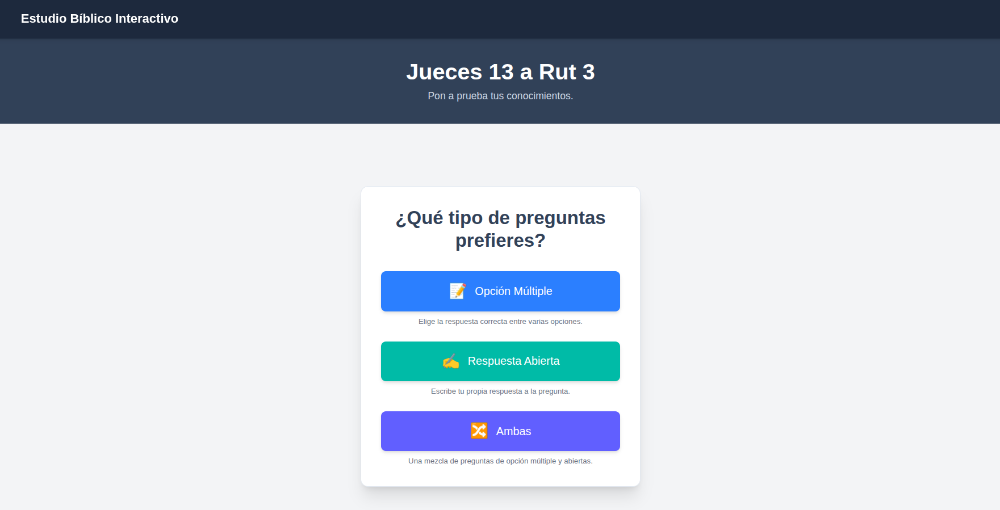

# Study Bible Quiz

A Next.js application for interactive Bible study through multiple-choice and open-answer questions. Users can test their knowledge of scripture and get immediate feedback on their answers with AI-powered verification.

## Live Demo

You can try out the live application here: [https://study-bible-smoky.vercel.app](https://bible-study-quizz.vercel.app/)

## Application Screenshot



## Features

- Interactive multiple-choice and open-answer quiz interface
- AI-powered answer verification using OpenAI
- Real-time answer verification
- Score tracking with visual indicators (✅/❌)
- Progress tracking with mastery and practice suggestions
- Bible passage references and links
- Responsive design with Tailwind CSS
- Supabase backend for question storage
- Randomized question order

## Tech Stack

- **Frontend**: Next.js 15, React 19, Tailwind CSS v4
- **Backend**: Next.js API routes
- **Database**: Supabase
- **AI**: OpenAI API for open-answer verification
- **Validation**: Zod for schema validation
- **Styling**: Tailwind CSS v4

## Getting Started

### Prerequisites

- Node.js 18 or later
- A Supabase account and project

### Installation

1. Clone the repository:

```bash
git clone <repository-url>
cd study-bible
```

2. Install dependencies:

```bash
npm install
```

3. Set up environment variables:
Create a `.env.local` file in the root directory and add your credentials:

```env
NEXT_PUBLIC_SUPABASE_URL=your_supabase_url
NEXT_PUBLIC_SUPABASE_ANON_KEY=your_supabase_anon_key
OPENAI_API_KEY=your_openai_api_key
```

4. Run the development server:

```bash
npm run dev
```

5. Open [http://localhost:3000](http://localhost:3000) in your browser.

## Database Schema

The application expects a `questions` table in Supabase with the following structure:

```sql
CREATE TABLE questions (
  id INTEGER PRIMARY KEY,
  text TEXT NOT NULL,
  options TEXT[], -- Optional for open-answer questions
  correctIndex INTEGER, -- Optional for open-answer questions  
  type TEXT, -- 'multiple-choice' or 'open-answer'
  reference TEXT,
  url TEXT
);
```

## API Endpoints

- `GET /api/getQuestions` - Retrieves all questions (without correct answers)
- `POST /api/verify` - Verifies a submitted multiple-choice answer
- `POST /api/verifyOpenAnswer` - Verifies open-answer questions using OpenAI

## Scripts

- `npm run dev` - Start development server with Turbopack
- `npm run build` - Build for production  
- `npm run start` - Start production server
- `npm run lint` - Run ESLint
